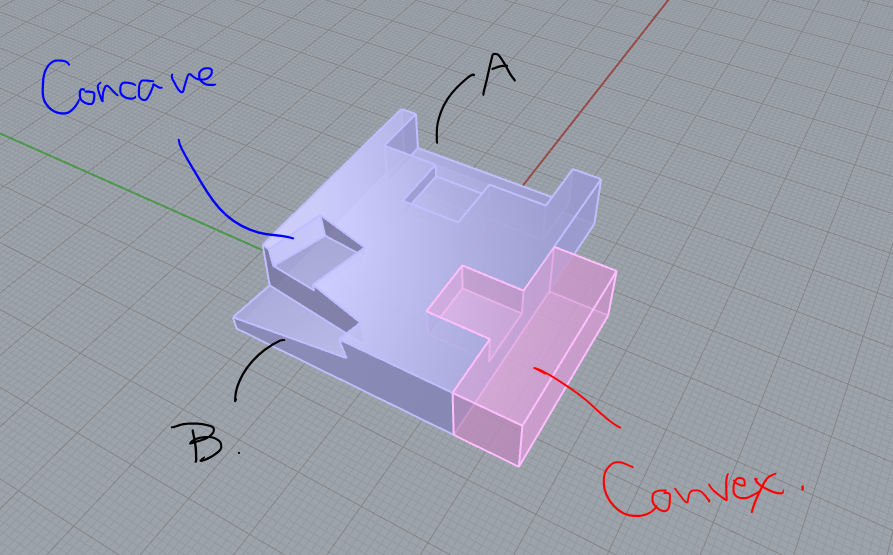

# Calc_Matrix_Study  


三次元ジオメトリの変換行列に関して解きたい問題がある。変換行列を使うということをあまりやったことがないのでここで試していきたい。  

~~Rhino for Mac では、GhPython から行列の要素にアクセスできず一日二日格闘して結局駄目だったが、Windows を使ったら普通にできたので Mac 版での動作は知りません。~~ 普通にできました。  


## アフィン変換  

アフィン変換 = 平行移動を伴う線形写像  

線形写像 = 回転（Rotation）、拡大縮小（Differential Scaling）、せん断（Skew）  


---  


## オペレーション  


### Rhino における変換行列  

ライノで変換行列が見えるのは、ブロックインスタンスを扱うときくらい？  

  


### Grasshopper における変換行列  

Grasshopper では、Transform 型がサポートされており、コンポーネントのカテゴリにも Transform がある。  

個人的に面白いなと思ったのは、オブジェクトを移動する Move コンポーネントや、オブジェクトを回転させる Rotate コンポーネントから、変換結果のオブジェクトと合わせて、変換行列が出力される。  

使いどころはわからないが、逆行列で戻せよという意味だろうか。  

（DisplayMatrix とかいうコンポーネントあったんですね。）  

  


### Grasshopper + GhPython における変換行列  

(X=1, Y=2, Z=3) の平行移動の変換行列を GhPython で読むと以下の通り。

```python
print(M)
### R0=(1,0,0,1), R1=(0,1,0,2), R2=(0,0,1,3), R3=(0,0,0,1)

print(type(M))
### <type 'Transform'>

print(M[0, 0], M[0, 1], M[0, 2], M[0, 3])
### (1.0, 0.0, 0.0, 1.0)

print(M[0, 3])
### 1.0

print(M[1, 3])
### 2.0

print(M[2, 3])
### 3.0

print(M[3, 3])
### 1.0
```

GhPython の関数を見ていると、transform 型のような意味で xform (transform) となっているが、同じようなものとみてよいのだろうか。  

transform 型（構造体）のプロパティとして、M00 という名前で0行目0個目の要素が入っている。以下は同じもの。

```python
print(M.M03)
### 1.0

print(M[0, 3]))
### 1.0
```

Rhino.Common の方のドキュメントを見ると、必要なものが実装されているのいるので、下手に CPython 使わないほうが良いという気持ちと、Numpy で書いた方が汎用性があるよねという気持ちがどちらもある。  

以下参照  
Transform Structure (RhinoCommon API)  
  - [https://developer.rhino3d.com/api/RhinoCommon/html/T_Rhino_Geometry_Transform.htm](https://developer.rhino3d.com/api/RhinoCommon/html/T_Rhino_Geometry_Transform.htm)  


### Python3 + Numpy  


---  


## 演算  

モデルケースとして以下のモデルを作成。  

Convex と Concave がそれぞれ一つずつブロックとなっている。  

移動や回転なく、ブロックを挿入すると以下の写真のように配置される。  

  

AB の箇所にはそれぞれ Convex がはまり、計4個のまとまりとして考える。そしてそれらの行列に以下の様に名前を付ける（配置したときにからそのままの配置ものが二つあるのでそれらを同じ名前にしている）。  

  

ちなみに、さらに変換行列を足されると以下のようになる。

  

行列の演算で調べたいのはこの場合。位置が少しだけずれている。  

  

位置ずれを調べるには以下のような、一つ親を決め、親と子のブロック同士の変換行列を導出すればよいはず。許容値に関して後で考える。  

  


### RhinoCommon を用いて演算する  


### Python3 + Numpy を用いて演算し、Grasshopper で表示を行う  


---  


## Ref  

Transform Structure (RhinoCommon API)  
- [https://developer.rhino3d.com/api/RhinoCommon/html/T_Rhino_Geometry_Transform.htm](https://developer.rhino3d.com/api/RhinoCommon/html/T_Rhino_Geometry_Transform.htm)  


デジタル画像と定量化その６：アフィン変換・位置合わせ  
  - [http://www2.riken.jp/brict/Yoshizawa/Lectures/Kyuusyu/Lectures2011_06.pdf](http://www2.riken.jp/brict/Yoshizawa/Lectures/Kyuusyu/Lectures2011_06.pdf)  


ゲームグラフィックス特論  
  - [https://tokoik.github.io/gg/ggbook03.pdf](https://tokoik.github.io/gg/ggbook03.pdf)  